# NETFLIX CLONE

## Software Documentation Book

---

# Table of Contents

1. [INTRODUCTION](#chapter-1-introduction)
  1.1 Project Overview
  1.2 Project Objectives
  1.3 Scope
  1.4 Motivation
  1.5 Features
  1.6 Software Requirements
  1.7 Hardware Requirements
  1.8 Technologies Used
  1.9 Advantages
  1.10 Limitations
  1.11 Future Scope

2. [PROJECT ARCHITECTURE](#chapter-2-project-architecture)
  2.1 Frontend Architecture
  2.2 Backend Architecture
  2.3 API Architecture
  2.4 Data Flow
  2.5 Component Architecture
  2.6 Folder Architecture

3. [PROJECT FOLDER STRUCTURE](#chapter-3-project-folder-structure)
  3.1 Root Files
  3.2 Public Folder
  3.3 src Folder
  3.4 Assets Folder
  3.5 Components Folder
  3.6 Pages Folder
  3.7 Songs Folder
  3.8 Config Files

4. [COMPLETE REACT CONCEPTS](#chapter-4-complete-react-concepts)
  4.1 React
  4.2 JSX
  4.3 Components
  4.4 Functional Components
  4.5 Props
  4.6 State
  4.7 useState
  4.8 useEffect
  4.9 useRef
  4.10 useMemo
  4.11 useCallback
  4.12 Context API
  4.13 React Router
  4.14 Routes
  4.15 BrowserRouter
  4.16 Route
  4.17 Link
  4.18 useNavigate
  4.19 Conditional Rendering
  4.20 List Rendering
  4.21 Keys
  4.22 Event Handling
  4.23 Forms
  4.24 Controlled Components
  4.25 Uncontrolled Components
  4.26 Hooks
  4.27 Lifecycle
  4.28 Virtual DOM
  4.29 Diffing Algorithm
  4.30 Reconciliation
  4.31 DOM Rendering
  4.32 Rendering Process
  4.33 Component Re-rendering
  4.34 React Strict Mode
  4.35 Lazy Loading
  4.36 Code Splitting
  4.37 Performance Optimization
  4.38 API Fetching
  4.39 Error Handling
  4.40 Loading State
  4.41 Search Filtering
  4.42 Pagination
  4.43 Authentication
  4.44 Protected Routes

5. [COMPLETE CODE EXPLANATION](#chapter-5-complete-code-explanation)
  5.1 package.json
  5.2 package-lock.json
  5.3 .gitignore
  5.4 .oxlintrc.json
  5.5 vite.config.js
  5.6 index.html
  5.7 src/index.css
  5.8 src/main.jsx
  5.9 src/App.jsx
  5.10 Navbar/Navbar.jsx
  5.11 Navbar/Navbar.css
  5.12 Footer/Footer.jsx
  5.13 Footer/Footer.css
  5.14 TittleCards/TitleCard.jsx
  5.15 TittleCards/TitleCard.css
  5.16 Home/Home.jsx
  5.17 Home/Home.css
  5.18 Movies/Movies.jsx
  5.19 Movies/Movies.css
  5.20 Player/Player.jsx
  5.21 Player/Player.css
  5.22 Login/Login.jsx
  5.23 Login/Login.css
  5.24 songs/Songs.jsx
  5.25 assets/cards/Cards_data.js
  5.26 public assets

6. [COMPONENT COMMUNICATION](#chapter-6-component-communication)
  6.1 Parent-to-Child Communication
  6.2 Child-to-Parent Communication
  6.3 Props Flow
  6.4 State Flow
  6.5 API Flow
  6.6 Rendering Flow

7. [COMPLETE APPLICATION FLOW](#chapter-7-complete-application-flow)
  7.1 Website Launch
  7.2 React Startup
  7.3 main.jsx
  7.4 App.jsx
  7.5 Router
  7.6 Component Loading
  7.7 API Request
  7.8 JSON Response
  7.9 State Update
  7.10 Virtual DOM
  7.11 Real DOM
  7.12 UI Rendering
  7.13 User Interaction
  7.14 Re-render

8. [API EXPLANATION](#chapter-8-api-explanation)
  8.1 External APIs Used
  8.2 TMDB Endpoints
  8.3 Headers
  8.4 Authorization
  8.5 Parameters
  8.6 Movie ID
  8.7 Language
  8.8 Page
  8.9 Request and Response
  8.10 JSON
  8.11 Status Codes
  8.12 Error Handling
  8.13 Network Flow
  8.14 Async/Await
  8.15 Promises

9. [BACKEND LOGIC](#chapter-9-backend-logic)
  9.1 External Backend Services
  9.2 REST API
  9.3 Server
  9.4 Request
  9.5 Response
  9.6 Database
  9.7 JSON
  9.8 Authentication
  9.9 Authorization
  9.10 Token Validation
  9.11 Backend Workflow Diagrams

10. [CSS EXPLANATION](#chapter-10-css-explanation)
  10.1 CSS Folder Structure
  10.2 Styling Approach
  10.3 Flexbox
  10.4 Grid
  10.5 Responsive Design
  10.6 Media Queries
  10.7 Animations
  10.8 Hover Effects
  10.9 Positioning
  10.10 Spacing
  10.11 Colors
  10.12 Typography
  10.13 CSS and React Connection

11. [COMPLETE EXECUTION FLOW](#chapter-11-complete-execution-flow)
  11.1 Application Start
  11.2 Import Order
  11.3 Rendering Order
  11.4 State Update Flow
  11.5 Component Update Flow
  11.6 API Execution Order
  11.7 DOM Update Process

12. [DIAGRAMS](#chapter-12-diagrams)
  12.1 Architecture Diagram
  12.2 Flowchart
  12.3 Sequence Diagram
  12.4 Component Diagram
  12.5 Use Case Diagram
  12.6 Activity Diagram
  12.7 State Diagram
  12.8 Deployment Diagram
  12.9 ER Diagram
  12.10 Data Flow Diagram
  12.11 Folder Structure Diagram
  12.12 React Rendering Diagram
  12.13 Virtual DOM Diagram
  12.14 API Communication Diagram

13. [REACT INTERNAL WORKING](#chapter-13-react-internal-working)
  13.1 JSX to JavaScript
  13.2 Babel and Vite
  13.3 ReactDOM
  13.4 Virtual DOM
  13.5 Reconciliation
  13.6 Diffing Algorithm
  13.7 Internal State Storage
  13.8 Internal Hooks Storage
  13.9 Re-render Decision
  13.10 useEffect Execution
  13.11 useState Internals
  13.12 React Router Internals

14. [PERFORMANCE](#chapter-14-performance)
  14.1 Performance Optimization Used
  14.2 Possible Improvements
  14.3 Code Quality
  14.4 Best Practices
  14.5 Memory Optimization
  14.6 Rendering Optimization

15. [INTERVIEW QUESTIONS](#chapter-15-interview-questions)
  15.1 Beginner Questions
  15.2 Intermediate Questions
  15.3 Advanced Questions

16. [IMPROVEMENTS](#chapter-16-improvements)
  16.1 Security Improvements
  16.2 Performance Improvements
  16.3 UI Improvements
  16.4 Backend Improvements
  16.5 Scalability
  16.6 Maintainability
  16.7 Production Readiness

---

# CHAPTER 1 – INTRODUCTION

## 1.1 Project Overview

This project is a React-based Netflix-style clone built using Vite, React 19, and React Router. It is a single-page application that offers a home landing page, a movies and TV shows browsing page, a trailer player page, a login-screen simulation, and a songs page. The app integrates external movie data from TMDB and uses embedded video providers for playback.

The UI is dark-themed and styled to resemble a media streaming service with hero banners, category strips, search functionality, and responsive page sections.

## 1.2 Project Objectives

- Demonstrate React fundamentals with a complete front-end application.
- Integrate external REST APIs for dynamic content.
- Implement client-side routing and page navigation.
- Build an interactive, responsive user interface.
- Provide a complete portfolio-ready project suitable for academic submission.

## 1.3 Scope

- Frontend-only implementation with no custom backend server.
- External APIs are consumed from TMDB and Rumble.
- Provides routing for multiple pages and simulated login.
- Supports browsing movies, TV shows, and trailers.
- Does not include actual user authentication or persistent user data storage.

## 1.4 Motivation

The motivation for this project is to create a recognizable streaming platform clone that demonstrates modern React development skills. It is intended for:

- Final year major project submissions.
- University project reports.
- Technical interview preparation.
- Software documentation and technical reference.

## 1.5 Features

- Home page with hero banner and content strips.
- Category browsing for Movies and TV Shows.
- Search bar with debounced TMDB search results.
- Trailer player with fallback if no video exists.
- Responsive navbar and mobile menu.
- Login page UI with sign-in / sign-up toggle.
- Rumble-based Songs page.
- Sticky category tabs on the Movies page.
- Load more pagination for movie results.

## 1.6 Software Requirements

- Node.js 18+.
- npm 10+ or compatible package manager.
- Modern browser with ES module support.
- Internet access for API calls and external assets.

## 1.7 Hardware Requirements

- Standard laptop or desktop computer.
- Minimum 2 GB RAM; 4 GB recommended.
- No specialized GPU required.
- Internet connection to fetch external API data.

## 1.8 Technologies Used

- React 19
- Vite
- React Router 7
- JavaScript (ES Modules)
- CSS
- Fetch API
- TMDB REST API
- YouTube embed
- Rumble embed

## 1.9 Advantages

- Lightweight and fast development experience with Vite.
- Clean component-based architecture.
- Real external API integration.
- Responsive design across devices.
- Polished Netflix-inspired UI.

## 1.10 Limitations

- No real authentication backend.
- API authorization token is placeholder text and not secure.
- No server-side rendering.
- No global error handling or user notifications for failed API calls.
- Some assets and imports are unused.

## 1.11 Future Scope

- Add real backend authentication and user sessions.
- Store API keys securely in environment variables.
- Add watch history, favorites, and user profiles.
- Implement cache and offline support.
- Add unit tests and integration tests.
- Migrate to TypeScript for stronger typing.
- Add better accessibility and keyboard navigation.

---

# CHAPTER 2 – PROJECT ARCHITECTURE

## 2.1 Frontend Architecture

The project is a React single-page application (SPA). It uses Vite as the build tool and React Router for navigation. The frontend is composed of page components and shared UI components.

- `main.jsx` mounts the React application.
- `App.jsx` defines the client-side routes.
- Each page component handles its own rendering and data fetching.
- Shared components like `Navbar` and `Footer` provide consistent UI across pages.
- CSS is scoped to individual components and pages.

## 2.2 Backend Architecture

This repository does not include a custom backend. The backend architecture is external and relies on:

- TMDB API for movie and TV show data.
- Third-party video providers for playback and embedded content.

The app communicates directly from the browser to external RESTful services.

## 2.3 API Architecture

The API architecture is REST-based. The app makes HTTP GET requests using the browser Fetch API. Endpoints include:

- `/search/movie`
- `/movie/popular`
- `/movie/top_rated`
- `/movie/now_playing`
- `/movie/upcoming`
- `/discover/movie`
- `/tv/popular`
- `/tv/top_rated`
- `/tv/on_the_air`
- `/tv/airing_today`
- `/movie/{id}/videos`
- `/tv/{id}/videos`
- `/movie/{id}`
- `/tv/{id}`

Requests include JSON accept headers and an Authorization header. Responses contain JSON objects with film metadata.

## 2.4 Data Flow

Data flows in the application as follows:

- User interaction triggers a route change or state update.
- Components run `useEffect` hooks for API fetches.
- The app requests JSON from TMDB.
- The response updates component state.
- React re-renders the affected component tree.
- The browser DOM is patched.

## 2.5 Component Architecture

The component architecture is hierarchical:

- `App.jsx` is the top-level router.
- `Navbar` is a shared component present on multiple pages.
- `Footer` is reused on Home and Movies.
- `TitleCard` is a reusable content strip on the Home page.
- Pages are the main route renderers: `Home`, `Movies`, `Player`, `Login`, `Songs`.

Diagram:

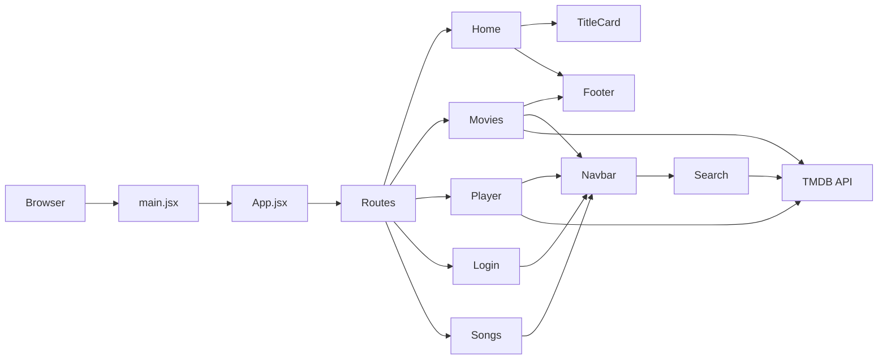

## 2.6 Folder Architecture

- `public/` contains static assets served directly by Vite.
- `src/` contains all React source code, components, pages, and CSS.
- `src/assets/` stores icons and images.
- `src/components/` stores reusable UI components.
- `src/pages/` stores route-specific page components.
- `src/songs/` stores the standalone Songs page.

Each folder is designed to group related files by feature and responsibility.

---

# CHAPTER 3 – PROJECT FOLDER STRUCTURE

## 3.1 Root Files

- `package.json`: defines dependencies, scripts, and metadata.
- `package-lock.json`: locks exact dependency versions.
- `.gitignore`: lists files and directories excluded from source control.
- `.oxlintrc.json`: configures lint rules for React and Oxc.
- `vite.config.js`: Vite build configuration enabling React plugin.
- `README.md`: default project instructions.
- `index.html`: static HTML shell with the React mount point.

## 3.2 Public Folder

Contains assets served directly without bundling:

- `background_banner.jpg`: login page background.
- `hero_banner.jpg`: home hero banner image.
- `hero_title.png`: home hero title overlay.
- `netflix_favicon.ico`: browser favicon.

Public assets are referenced with absolute URLs such as `/hero_banner.jpg`.

## 3.3 src Folder

`src` contains all application source files:

- `index.css`: global styling and font import.
- `main.jsx`: React entry point.
- `App.jsx`: routing configuration.
- `components/`: reusable UI components.
- `pages/`: page-level components.
- `songs/`: a separate Songs page.
- `assets/`: images, icons, and static card data.

## 3.4 Assets Folder

`src/assets` includes static images and cards metadata:

- Brand assets: `logo.png`, `profile_img.png`, icons.
- `netflix_spinner.gif`: unused loading spinner asset.
- `cards/`: 14 movie card images and `Cards_data.js`.

`Cards_data.js` exports a static array of card objects, but the current code does not use this dataset.

## 3.5 Components Folder

`src/components` contains shared UI components:

- `Navbar/`: top navigation bar.
- `Footer/`: footer and social links.
- `TittleCards/`: horizontal card strips used on the Home page.

Each component directory contains a `.jsx` file and a `.css` file.

## 3.6 Pages Folder

`src/pages` contains the main route components:

- `Home/`: landing page.
- `Movies/`: browsing page.
- `Player/`: trailer player page.
- `Login/`: login UI page.

Each page has its own CSS file to keep styling scoped and maintainable.

## 3.7 Songs Folder

`src/songs/Songs.jsx` is a standalone route component that uses inline styles and embedded Rumble videos.

## 3.8 Config Files

- `.oxlintrc.json`: React hook linting and component export rules.
- `vite.config.js`: configuration for Vite and React plugin.
- `.gitignore`: workspace ignores.

These files support development workflow, quality checks, and build configuration.

---

# CHAPTER 4 – COMPLETE REACT CONCEPTS

## 4.1 React

**Definition:** React is a JavaScript library for building user interfaces.

**Purpose:** Manage UI state and render the DOM efficiently.

**Syntax:** Import React when using JSX or hooks.

**Internal Working:** React maintains a virtual DOM and updates the real DOM selectively.

**Project Example:** `App.jsx` uses React components to define page routes.

## 4.2 JSX

**Definition:** JSX is a syntax extension for JavaScript that resembles HTML.

**Purpose:** Write UI markup directly within JavaScript functions.

**Syntax Example:**
```jsx
<div className="hero">
  
</div>
```

**Internal Working:** JSX is compiled into `React.createElement` calls by Vite's React plugin.

**Project Example:** All `.jsx` files use JSX to declare UI structure.

## 4.3 Components

**Definition:** Reusable pieces of UI logic and markup.

**Purpose:** Break complex interfaces into manageable building blocks.

**Syntax Example:**
```jsx
const Footer = () => {
  return <div className="footer">...</div>
}
```

**Project Example:** `Navbar`, `Footer`, `TitleCard`, and page components.

## 4.4 Functional Components

**Definition:** Components implemented as JavaScript functions.

**Purpose:** Simplify component creation and enable hooks.

**Syntax Example:**
```jsx
const Login = () => { ... }
```

**Project Example:** Every component in the repository is a functional component.

## 4.5 Props

**Definition:** Data passed from parent to child.

**Purpose:** Configure child components from the parent.

**Syntax Example:**
```jsx
<TitleCard title="Blockbuster Movies" category="top_rated" />
```

**Project Example:** `Home.jsx` passes `title` and `category` to `TitleCard`.

## 4.6 State

**Definition:** Local data stored in a component that affects rendering.

**Purpose:** Make UI interactive and responsive to user actions.

**Syntax Example:**
```jsx
const [searchQuery, setSearchQuery] = useState('')
```

**Project Example:** `Movies.jsx` stores `activeCategory`, `movies`, and `loading` states.

## 4.7 useState

**Definition:** Hook that declares state in a functional component.

**Purpose:** Persist values across renders and trigger re-renders when updated.

**Syntax:**
```jsx
const [value, setValue] = useState(initialValue)
```

**Project Example:** Many components use `useState`, including `Navbar`, `Player`, and `Login`.

## 4.8 useEffect

**Definition:** Hook for running side effects after render.

**Purpose:** Fetch data, subscribe to events, manage timers, and update the DOM.

**Syntax:**
```jsx
useEffect(() => {
  // effect
}, [dependencies])
```

**Internal Working:** React executes effects after the browser paints the UI and cleans them up when dependencies change.

**Project Example:** `Navbar.jsx` uses `useEffect` to register scroll and outside click listeners and fetch search results.

## 4.9 useRef

**Definition:** Hook that stores a mutable value and references DOM elements.

**Purpose:** Access DOM nodes or persist values without causing re-renders.

**Syntax:**
```jsx
const inputRef = useRef(null)
```

**Project Example:** `Navbar.jsx` uses `searchRef` and `inputRef` for focus control and click-outside detection.

## 4.10 useMemo

**Definition:** Hook for memoizing expensive calculations.

**Note:** Not used in this project.

## 4.11 useCallback

**Definition:** Hook that memoizes function references.

**Purpose:** Prevent unnecessary recreation of functions and support stable dependencies.

**Syntax:**
```jsx
const fetchPage = useCallback(async (catKey, pageNum) => { ... }, [])
```

**Project Example:** `Movies.jsx` uses `useCallback` for the `fetchPage` function.

## 4.12 Context API

**Definition:** React feature for sharing data across many components without prop drilling.

**Note:** Not used in this project.

## 4.13 React Router

**Definition:** Library for handling client-side navigation.

**Purpose:** Map URLs to components and allow SPA navigation.

**Project Example:** `App.jsx` defines routes and `main.jsx` wraps the app in `BrowserRouter`.

## 4.14 Routes

**Definition:** Container for route definitions.

**Purpose:** Match the current URL against route paths.

**Syntax:**
```jsx
<Routes>
  <Route path="/" element={<Home />} />
</Routes>
```

**Project Example:** `App.jsx` uses `Routes` and `Route`.

## 4.15 BrowserRouter

**Definition:** Router implementation based on HTML5 History API.

**Purpose:** Manage URL changes without page reloads.

**Project Example:** `main.jsx` wraps `<App />` in `<BrowserRouter>`.

## 4.16 Route

**Definition:** Defines a URL path and the component to render.

**Project Example:** `/player/:id` is a dynamic route in `App.jsx`.

## 4.17 Link

**Definition:** React Router component for navigation.

**Purpose:** Navigate within the SPA without refreshing.

**Project Example:** `Navbar.jsx` uses `Link` for nav links and `TitleCard.jsx` uses `Link` for each card.

## 4.18 useNavigate

**Definition:** Hook that returns a navigation function.

**Purpose:** Navigate programmatically from event handlers.

**Project Example:** `Login.jsx`, `Navbar.jsx`, `Movies.jsx`, and `Player.jsx` all use `useNavigate()`.

## 4.19 Conditional Rendering

**Definition:** Render UI elements only when certain conditions are true.

**Project Example:** `Navbar.jsx` renders the search dropdown only when `searchOpen` is true and query text exists.

## 4.20 List Rendering

**Definition:** Render arrays using `.map()`.

**Project Example:** `movies.map(movie => ...)` in `Movies.jsx`, `NAV_LINKS.map` in `Navbar.jsx`, and `searchResults.map` in `Navbar.jsx`.

## 4.21 Keys

**Definition:** Unique identifier for list items.

**Purpose:** Help React track changes in lists during reconciliation.

**Project Example:** `key={movie.id}` in `Movies.jsx` and `key={link.path}` in `Navbar.jsx`.

## 4.22 Event Handling

**Definition:** Respond to user interactions using event handlers.

**Project Example:** `onClick`, `onChange`, `onKeyDown`, `onMouseEnter`, and `onMouseLeave` are used across components.

## 4.23 Forms

**Definition:** Manage user input via form elements.

**Project Example:** `Login.jsx` includes email, password, and name inputs within a form.

## 4.24 Controlled Components

**Definition:** Inputs whose values are managed by React state.

**Project Example:** `Login.jsx` uses state for email, password, and name inputs.

## 4.25 Uncontrolled Components

**Definition:** Inputs that manage their own state and are accessed with refs.

**Note:** Not used in this project.

## 4.26 Hooks

**Definition:** Special functions that let you use React features in functional components.

**Project Example:** The project uses `useState`, `useEffect`, `useRef`, and `useCallback`.

## 4.27 Lifecycle

Functional components use `useEffect` to emulate lifecycle behavior:

- Mount: `useEffect(..., [])`
- Update: `useEffect(..., [dependency])`
- Unmount: return cleanup function from `useEffect`

## 4.28 Virtual DOM

**Definition:** React's in-memory tree representation of UI.

**Purpose:** Enable efficient updates by comparing virtual DOM states before touching the browser DOM.

**Project Example:** Every component render produces a virtual DOM tree.

## 4.29 Diffing Algorithm

**Definition:** The algorithm that compares old and new virtual DOM trees and computes the minimal DOM changes.

**Project Relevance:** Used whenever state or props change, e.g., updating the movie grid after an API fetch.

## 4.30 Reconciliation

**Definition:** The process React uses to determine how to update the DOM after a render.

**Project Example:** When `setMovies()` updates the array in `Movies.jsx`, React reconciles the list and updates only changed cards.

## 4.31 DOM Rendering

**Definition:** Applying React's computed changes to the actual browser DOM.

**Project Relevance:** After state updates, React patches the DOM elements in the page.

## 4.32 Rendering Process

**General Steps:**
1. A component function is called.
2. React records hook calls in order.
3. JSX is converted to virtual DOM.
4. React diff-checks against previous virtual DOM.
5. DOM updates are applied.

## 4.33 Component Re-rendering

**Causes:**
- Local state changes.
- Parent re-renders.
- Props changes.

**Project Example:** `Movies` re-renders when `activeCategory`, `movies`, or `page` changes.

## 4.34 React Strict Mode

**Definition:** A development-only feature that highlights potential problems.

**Project Note:** `StrictMode` is imported in `main.jsx` but not used.

## 4.35 Lazy Loading

**Definition:** Loading components only when needed.

**Project Note:** Not implemented. It could be added with `React.lazy` and `Suspense`.

## 4.36 Code Splitting

**Definition:** Splitting application code into smaller bundles.

**Project Note:** Not currently used. Route-level lazy loading would be beneficial.

## 4.37 Performance Optimization

**Used Examples:**
- Debounced search in `Navbar.jsx`.
- Stable `fetchPage` reference with `useCallback`.
- Lazy image loading in `Movies.jsx`.

## 4.38 API Fetching

**Definition:** Using `fetch()` to request external data.

**Project Example:** `Navbar`, `Movies`, `TitleCard`, and `Player` all make API calls.

## 4.39 Error Handling

**Current Approach:** `try/catch` in `Player.jsx` and `.catch()` in fetch chains.

**Limitation:** The app rarely displays user-facing error messages.

## 4.40 Loading State

**Practice:** Use boolean state to show loading spinners or skeletons.

**Project Example:** `initialLoading`, `loadingMore`, `isSearching`, and `loading` in `Player`.

## 4.41 Search Filtering

**Definition:** Filter API results before rendering.

**Project Example:** `Navbar.jsx` removes results with missing image paths.

## 4.42 Pagination

**Definition:** Loading content in pages rather than all at once.

**Project Example:** `Movies.jsx` loads three pages initially and appends more with `Load More`.

## 4.43 Authentication

**Project Note:** The login page simulates authentication and does not connect to a backend.

## 4.44 Protected Routes

**Definition:** Routes that require authentication.

**Project Note:** Not implemented. All routes are publicly accessible.

---

# CHAPTER 5 – COMPLETE CODE EXPLANATION

## 5.1 package.json

`package.json` declares the application metadata, development scripts, and dependencies.

Key values:
- `name`: netflix-clone
- `private`: true
- `type`: module
- `scripts`: `dev`, `build`, `lint`, and `preview`
- `dependencies`: `react`, `react-dom`, `react-router`, `react-router-dom`, `routing`
- `devDependencies`: `@types/react`, `@types/react-dom`, `@vitejs/plugin-react`, `oxlint`, `vite`

Important notes:
- `routing` is included but unused in the source code.
- `type: module` enables modern ES module imports.

## 5.2 package-lock.json

`package-lock.json` locks dependency versions and subdependency trees for reproducible installs. It is generated automatically by npm.

## 5.3 .gitignore

Excludes build artifacts, dependency folders, logs, and editor settings from version control. This prevents committing local and generated files.

## 5.4 .oxlintrc.json

Configures the OXlint tool:
- `react/rules-of-hooks`: enforce hook usage rules.
- `react/only-export-components`: warn if non-component exports appear in React files.

## 5.5 vite.config.js

Defines a Vite configuration that enables the React plugin:

```js
import { defineConfig } from 'vite'
import react from '@vitejs/plugin-react'

export default defineConfig({
  plugins: [react()],
})
```

This file exists to connect Vite and React, allowing JSX, HMR, and fast build.

## 5.6 index.html

The HTML entry point contains:
- `<meta charset="UTF-8" />`
- viewport meta tag.
- favicon reference.
- `<div id="root"></div>` for React mounting.
- script to load `main.jsx`.

This file is the shell that loads the React app into the browser.

## 5.7 src/index.css

Global CSS includes:
- Google Font import for `Poppins`.
- universal box-sizing reset.
- `body` background color, text color, and font family.

This file provides base styling for the entire app.

## 5.8 src/main.jsx

Entry point logic:

```jsx
import { StrictMode } from 'react'
import { createRoot } from 'react-dom/client'
import './index.css'
import App from './App.jsx'
import { BrowserRouter } from 'react-router'

createRoot(document.getElementById('root')).render(
  <BrowserRouter>
    <App />
  </BrowserRouter>
)
```

Explanation:
- Imports `createRoot` to initialize the React root.
- Imports global CSS.
- Wraps `App` in `BrowserRouter` for routing.
- Renders the application into `#root`.

Note: `StrictMode` is imported but unused.

## 5.9 src/App.jsx

This file defines the top-level routes:

```jsx
import React from 'react'
import Home from './pages/Home/Home'
import Login from './pages/Login/Login'
import { Routes, Route } from 'react-router-dom'
import Player from './pages/Player/Player'
import Movies from './pages/Movies/Movies'
import Songs from './songs/Songs'

const App = () => {
  return (
    <div>
      <Routes>
        <Route path='/'           element={<Home />} />
        <Route path='/login'      element={<Login />} />
        <Route path='/player/:id' element={<Player />} />
        <Route path='/movies'     element={<Movies />} />
        <Route path='/tvshows'    element={<Movies />} />
        <Route path='/newpopular' element={<Movies />} />
        <Route path='/songs'      element={<Songs />} />
      </Routes>
    </div>
  )
}

export default App
```

This component exists to map each route path to the correct page component.

## 5.10 src/components/Navbar/Navbar.jsx

Purpose: A top navigation component with links, search, profile dropdown, and scroll behavior.

### Imports
- `React`, `useState`, `useEffect`, `useRef`
- CSS file `./Navbar.css`
- image assets: `logo`, `search_icon`, `bell_icon`, `caret_icon`, `profile_img`
- `useNavigate`, `useLocation`, `Link` from `react-router-dom`

### Constants
- `NAV_LINKS`: array of navigation items.
- `options`: fetch options object with placeholder Authorization header.

### State
- `searchOpen`: whether search input and dropdown are visible.
- `searchQuery`: current search text.
- `searchResults`: array of fetched movie results.
- `isSearching`: whether a search API call is active.
- `scrolled`: whether the page has been scrolled beyond 60px.

### Refs
- `searchRef`: reference to the search container for outside-click detection.
- `inputRef`: reference to the text input to focus when opened.

### Router hooks
- `navigate`: programmatic navigation.
- `location`: current path for active link detection.

### Effects
- Scroll effect toggles `scrolled` when the page is scrolled.
- Search effect debounces TMDB search API calls by 400ms.
- Outside click effect closes search when the user clicks outside the dropdown.

### Handlers
- `handleSearchIconClick`: toggles search open state and clears search when closing.
- `handleResultClick`: navigates to `/player/:id` and clears search state.
- `isActive`: computes whether a nav link is active based on the current URL.

### JSX and rendering
- A fixed `<nav>` with dynamic class `navbar-solid` when scrolled.
- Desktop nav links and a mobile browse dropdown.
- Search container with animated input and results dropdown.
- Profile area with hover dropdown and sign-in button.

### Performance notes
- Debouncing search input reduces API traffic.
- `onError` on poster images prevents broken thumbnails from showing.

## 5.11 src/components/Navbar/Navbar.css

This file styles the navbar:
- Fixed top bar with transparent background.
- Solid background after scrolling.
- Desktop nav links and mobile browse dropdown.
- Search animation and results dropdown styling.
- Profile dropdown with hover interaction.
- Responsive breakpoints for smaller screens.

## 5.12 src/components/Footer/Footer.jsx

Purpose: A footer component with social icons and a list of static links.

Imports:
- `React`
- `./Footer.css`
- `youtube_icon`, `twitter_icon`, `instagram_icon`, `facebook_icon`

Render:
- `.footer` container.
- `.footer-icons` row of clickable icons.
- `<ul>` list of footer items.
- Copyright text.

This component is static and reusable across pages.

## 5.13 src/components/Footer/Footer.css

Styles the footer layout and responsiveness:
- Horizontal icon row.
- Grid-based list of links.
- Hover effects on list items.
- Responsive column count changes at 700px and 400px.

## 5.14 src/components/TittleCards/TitleCard.jsx

Purpose: A reusable horizontal card list that fetches TMDB movies by category.

### Imports
- `React`, `useEffect`, `useState` from 'react'
- `./TitleCard.css`
- `cards_data` from `../../assets/cards/Cards_data` (unused)
- `useRef`
- `Link` from `react-router`

### State
- `apiData`: array of fetched movie/show cards.

### Refs
- `cardsRef`: reference for the horizontal scroll container.

### Constants and logic
- `options`: fetch header object with placeholder Authorization.
- `handleWheel`: a wheel event handler that would scroll horizontally but is not attached.

### Effect
- Uses `useEffect` to determine a TMDB endpoint based on the `category` prop.
- Fetches data and filters out items without poster or backdrop images.
- Updates `apiData`.

### JSX
- Renders a container with a heading.
- Maps `apiData` into `<Link>` cards with poster images.
- Links each card to `/player/${card.id}`.

### Notes
- The `cards_data` import is unused, indicating legacy code.
- The `handleWheel` function is defined but not attached to any DOM element.
- The component uses `key={index}`, which is acceptable for static cards, but a stable unique ID would be better.

## 5.15 src/components/TittleCards/TitleCard.css

Styles the horizontal card strip:
- Horizontal scrolling container with hidden scrollbar.
- Card image sizing and hover scaling.
- Responsive image sizes and text.
- Positioning for overlay text.

## 5.16 src/pages/Home/Home.jsx

Purpose: Renders the landing page with a hero banner and category strips.

### Imports
- `React`
- `./Home.css`
- `Navbar`
- `play_icon`, `info_icon`
- `TitleCard`
- `Footer`

### JSX
- `<Navbar />`
- `hero` section with `hero_banner.jpg` and `hero_title.png`.
- Call-to-action buttons: Play and More Info.
- `<TitleCard />` default strip.
- Additional `TitleCard` sections for `top_rated`, `upcoming`, `telugu`, `telugu-latest`, and `telugu-top`.
- `<Footer />`

### Notes
- The home hero uses public assets loaded from `/hero_banner.jpg`.
- `TitleCard` components load movie data for each category.

## 5.17 src/pages/Home/Home.css

Styles the home page hero and layout:
- Absolute hero caption overlay.
- Responsive hero height and font scaling.
- Buttons with white and dark variants.
- Padding for `more-cards` sections.
- Mobile-specific layout adjustments.

## 5.18 src/pages/Movies/Movies.jsx

Purpose: Renders the movies and TV shows browsing page with categories and pagination.

### Imports
- `React`, `useState`, `useEffect`, `useCallback`
- `./Movies.css`
- `Navbar`, `Footer`
- `useNavigate`, `useSearchParams`, `useLocation`

### Constants
- `OPTIONS`: fetch headers with placeholder Authorization.
- `buildUrl(key, page)`: builds TMDB endpoint URLs for categories.
- `MOVIE_CATS` and `TV_CATS`: category definitions.
- `INITIAL_PAGES = 3`: initial number of pages to load.

### State
- `activeCategory`: current user-selected category.
- `movies`: array of loaded movie/show data.
- `page`: current last page loaded.
- `totalPages`: total pages available from TMDB.
- `initialLoading`: whether the initial category load is in progress.
- `loadingMore`: whether additional pages are loading.
- `hoveredId`: hovered card identifier.

### Router and location
- `location.pathname` identifies whether the page is TV or movies.
- `useSearchParams()` reads and updates the `category` query parameter.

### Functions
- `fetchPage`: async function memoized with `useCallback()` to fetch one page of results and filter them.
- `handleLoadMore`: loads the next page, appending items while avoiding duplicates.
- `handleCategoryClick`: changes category and updates the query string.
- `handleMovieClick`: navigates to `/player/${id}`.
- `hasMore`: boolean that indicates if more pages remain.

### Effects
- `useEffect` runs when `activeCategory` changes.
- It resets movies and loads the first three pages in parallel with `Promise.all`.
- Deduplicates results by `id`.

### JSX
- Renders `Navbar`.
- Hero section with an overlaid back button, headline, tagline, and stats.
- Sticky category tab row.
- Grid section with skeleton cards while loading.
- Movie cards with overlay and metadata.
- Load More button or all-loaded indicator.
- `Footer`

### Behavior
- `Movies` can represent movies or TV, based on the current route.
- It loads more content as the user clicks `Load More`.
- It offers a smooth experience with skeleton loaders and hover effects.

## 5.19 src/pages/Movies/Movies.css

Styles the movies page:
- Hero section with gradient backgrounds and animation.
- Sticky category tabs with pill buttons.
- Responsive movie grid layout.
- Hover card overlays and play button overlay.
- Loading skeleton styles.
- Load More button transitions.
- Responsive breakpoints for smaller screens.

## 5.20 src/pages/Player/Player.jsx

Purpose: Fetch and render the best available trailer video for a movie or TV show.

### Imports
- `React`, `useEffect`, `useState`
- `./Player.css`
- `back_arrow_icon`
- `useNavigate`, `useParams`

### Constants
- `OPTIONS`: fetch headers with placeholder Authorization.
- `VIDEO_PRIORITY`: preferred video types.

### Helper function
- `pickBestVideo(results)`: filters to YouTube videos and chooses the best available type.

### State
- `videoData`: selected trailer metadata.
- `mediaInfo`: title, overview, rating, and release data.
- `loading`: whether trailer details are being fetched.
- `mediaType`: `'movie'` or `'tv'`

### Effect
- Triggered when `id` changes.
- Attempts movie videos first:
  1. Fetch `/movie/${id}/videos`
  2. If a valid video exists, fetch `/movie/${id}` details.
  3. If no movie trailer, fetch TV videos and details.
  4. If still no trailer, fetch a broad movie video list without language.
- Sets `loading` false when complete.
- Uses `try/catch` to catch network or parsing errors.

### JSX
- Back button that navigates back.
- Loading state spinner and message.
- YouTube iframe when trailer data exists.
- Fallback information card when trailer is unavailable.
- Info section with title, tags, year, rating, and overview.
- A Rumble embed iframe included at the bottom.

### Notes
- The page supports both movie and TV IDs using fallback logic.
- It uses media metadata to show a proper title and extra details.

## 5.21 src/pages/Player/Player.css

Styles the player page:
- Centered layout with background effects.
- Back button with animation.
- Loading spinner and video frame styles.
- Responsive iframe and info section.
- Fallback screen styling.
- Mobile-specific adjustments.

## 5.22 src/pages/Login/Login.jsx

Purpose: Render a login/sign-up page with simulated authentication behavior.

### Imports
- `React`, `useState`
- `./Login.css`
- `logo`
- `useNavigate`

### State
- `signinState`: toggles between `'Sign In'` and `'Sign Up'`.
- `email`, `password`, `name`: form input values.
- `loading`: whether the form is submitting.

### Handler
- `handleSubmit`: prevents default form submission, simulates async authentication with `setTimeout`, then navigates to `/`.

### JSX
- Top logo that navigates back home.
- Login card with conditional name field for sign-up.
- Form elements styled with floating labels.
- Submit button with loading spinner.
- Remember me checkbox and help text.
- Toggle text to switch between sign in and sign up.

### Notes
- No actual authentication occurs; it only simulates delay and then redirects.
- The form uses controlled components for inputs.

## 5.23 src/pages/Login/Login.css

Styles the login page:
- Full-screen background with overlay.
- Glassmorphism login card.
- Floating label input fields.
- Animated submit button and spinner.
- Responsive mobile behavior.

## 5.24 src/songs/Songs.jsx

Purpose: Render a songs page with embedded video content.

### Imports
- `React`

### JSX
- A full-screen dark background container.
- Two embedded Rumble iframes.
- Song title and description text.

### Notes
- Styling is defined inline within the JSX.
- The page is simple and does not use a separate CSS file.

## 5.25 src/assets/cards/Cards_data.js

Purpose: Provide a static array of card metadata.

### Content
- Imports 14 `cardX.jpg` images.
- Exports an array of objects with `image` and `name`.

### Notes
- This file is imported by `TitleCard.jsx` but not used.
- It is a candidate for removal or future use.

## 5.26 public assets

Public assets are used directly in the app:
- `hero_banner.jpg` and `hero_title.png` used by the Home page hero.
- `background_banner.jpg` used by the Login page.
- `netflix_favicon.ico` used in the browser tab.

---

# CHAPTER 6 – COMPONENT COMMUNICATION

## 6.1 Parent-to-Child Communication

The project uses props to pass data from parent components to child components.

Examples:
- `Home.jsx` passes `title` and `category` to `TitleCard`.
- `Navbar.jsx` uses `Link` components to navigate but does not receive props from `App`.

## 6.2 Child-to-Parent Communication

The project does not implement explicit child-to-parent callbacks. Most data changes happen locally within each component or through router navigation.

## 6.3 Props Flow

Props flow is primarily one-way:
- `Home` → `TitleCard`
- `App` → page components via route matching

## 6.4 State Flow

State is managed within local components:
- `Navbar`: search state and UI state.
- `Movies`: category selection and movie list state.
- `Player`: trailer and media detail state.
- `Login`: form field state.
- `TitleCard`: fetched cards list state.

No global shared state or context is used.

## 6.5 API Flow

API requests are initiated by individual components based on state or route changes:
- `Navbar`: search results.
- `Movies`: category discovery and pagination.
- `TitleCard`: home page category cards.
- `Player`: trailer and media details.

## 6.6 Rendering Flow

Sequence for `Movies` page:
1. Route sets active page.
2. `Movies` mounts.
3. `useEffect` fetches initial movie pages.
4. API response updates `movies` state.
5. React re-renders the component.
6. `movies.map` generates card JSX.

Component Communication Diagram:

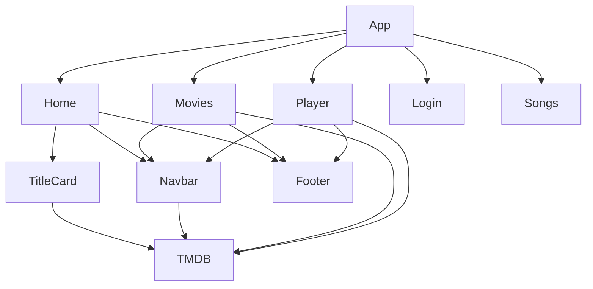

---

# CHAPTER 7 – COMPLETE APPLICATION FLOW

## 7.1 User opens website

The browser loads `index.html` from the server. This file contains the React mount point and script reference.

## 7.2 React starts

`main.jsx` runs in the browser using ES modules. It creates a React root and renders the application.

## 7.3 main.jsx

This file imports global CSS and `App.jsx`, wraps `App` in `BrowserRouter`, and mounts it into `#root`.

## 7.4 App.jsx

`App.jsx` defines the routing structure. It uses `Routes` and `Route` from React Router to map paths to page components.

## 7.5 Router

React Router matches the current URL and renders the corresponding page component. Example paths:
- `/`
- `/login`
- `/player/:id`
- `/movies`
- `/tvshows`
- `/newpopular`
- `/songs`

## 7.6 Component Loading

When a page route is selected, its associated component and its children mount. For example, `Home` mounts `Navbar`, `TitleCard`, and `Footer`.

## 7.7 API Request

Components use `fetch` to request data from TMDB when needed. Example:
- `Movies` fetches category pages.
- `Player` fetches trailer videos.
- `Navbar` fetches search results.

## 7.8 JSON Response

TMDB returns JSON with a `results` array, pagination metadata, and media fields.

## 7.9 State Update

The component updates state with the parsed JSON data. React schedules a re-render when state changes.

## 7.10 Virtual DOM

React creates a virtual DOM tree from the rendered JSX.

## 7.11 Real DOM

React diffs the new virtual DOM against the previous version and applies minimal changes to the real DOM.

## 7.12 UI Rendering

The browser paints the updated HTML and CSS onto the screen.

## 7.13 User Interaction

User actions trigger handlers such as `onClick`, `onChange`, `onMouseEnter`, and `onKeyDown`.

## 7.14 Re-render

React re-renders affected components when state or props change.

---

# CHAPTER 8 – API EXPLANATION

## 8.1 External APIs Used

The application consumes external services rather than a local backend:
- TMDB (The Movie Database) API for movie and TV data.
- YouTube embed for trailer playback.
- Rumble embed for songs.

## 8.2 TMDB Endpoints

The following TMDB endpoints are used:
- `https://api.themoviedb.org/3/search/movie`
- `https://api.themoviedb.org/3/movie/popular`
- `https://api.themoviedb.org/3/movie/top_rated`
- `https://api.themoviedb.org/3/movie/now_playing`
- `https://api.themoviedb.org/3/movie/upcoming`
- `https://api.themoviedb.org/3/discover/movie`
- `https://api.themoviedb.org/3/tv/popular`
- `https://api.themoviedb.org/3/tv/top_rated`
- `https://api.themoviedb.org/3/tv/on_the_air`
- `https://api.themoviedb.org/3/tv/airing_today`
- `https://api.themoviedb.org/3/movie/{id}/videos`
- `https://api.themoviedb.org/3/tv/{id}/videos`
- `https://api.themoviedb.org/3/movie/{id}`
- `https://api.themoviedb.org/3/tv/{id}`

## 8.3 Headers

All TMDB requests use:
- `accept: application/json`
- `Authorization: '******'`

The `Authorization` header is a placeholder and must be replaced with a valid token in production.

## 8.4 Authorization

TMDB requires an API key or bearer token for many endpoints. In this project, the token is obfuscated and should be stored securely outside source control.

## 8.5 Parameters

Common query parameters include:
- `query` for search terms.
- `language=en-US` for locale-specific results.
- `page` for pagination.
- `with_original_language=te` to filter Telugu movies.
- `sort_by=popularity.desc` and `vote_count.gte=100` to sort and filter results.

## 8.6 Movie ID

The `id` parameter is captured from route paths like `/player/:id`. It is used to fetch video details and movie or TV show metadata.

## 8.7 Language

The app requests English content with `language=en-US` and falls back to a broader request if no trailer is found.

## 8.8 Page

Pagination is controlled by the `page` parameter. `Movies.jsx` loads several pages in parallel and appends more as needed.

## 8.9 Request and Response

Requests are made with `fetch(url, OPTIONS)`. Responses are parsed with `res.json()`.

Example response fields:
- `results` array
- `total_pages`
- `poster_path`, `backdrop_path`, `title`, `name`, `overview`, `vote_average`

## 8.10 JSON

JSON is the data format exchanged between the client and TMDB. The application uses JSON responses to populate state and render content.

## 8.11 Status Codes

The code does not consistently check HTTP status codes. Most requests assume successful responses and parse JSON directly.

## 8.12 Error Handling

Error handling is present but minimal:
- `.catch()` handlers in search and fetch chains.
- `try/catch` in `Player.jsx`.

No user-facing error messages are displayed for most API failures.

## 8.13 Network Flow

Flow for a fetch request:
1. Component calls `fetch()`.
2. Browser sends HTTP request to TMDB.
3. TMDB responds with JSON.
4. Component updates state.
5. React re-renders.

## 8.14 Async/Await

Used in `Movies.jsx` and `Player.jsx` to write asynchronous code in a linear style.

Example:
```js
const res = await fetch(buildUrl(catKey, pageNum), OPTIONS)
const data = await res.json()
```

## 8.15 Promises

Used with `.then()` and `.catch()` in `Navbar.jsx` and `TitleCard.jsx`.

Example:
```js
fetch(url, options)
  .then(res => res.json())
  .then(res => setSearchResults(...))
  .catch(() => setIsSearching(false))
```

---

# CHAPTER 9 – BACKEND LOGIC

## 9.1 External Backend Services

This app does not include a local backend. TMDB acts as the backend service, providing movie data and video metadata.

## 9.2 REST API

TMDB exposes a REST API. The application uses standard HTTP GET requests to retrieve JSON.

## 9.3 Server

The backend server is TMDB's infrastructure. There is no server code in this repository.

## 9.4 Request

Requests are made directly from the browser to TMDB. Each request includes headers and query parameters.

## 9.5 Response

TMDB responds with JSON objects that contain the requested media data.

## 9.6 Database

No local database exists. TMDB maintains its own database of films and TV shows.

## 9.7 JSON

JSON is the interchange format used for all TMDB responses.

## 9.8 Authentication

TMDB authentication is represented by the Authorization header. In production, credentials should be kept safe and not embedded in client code.

## 9.9 Authorization

Proper authorization is required for TMDB requests. The app uses a placeholder token and must be updated for a working integration.

## 9.10 Token Validation

The current code does not validate the Authorization token. A production app should verify token presence and handle invalid credentials gracefully.

## 9.11 Backend Workflow Diagrams

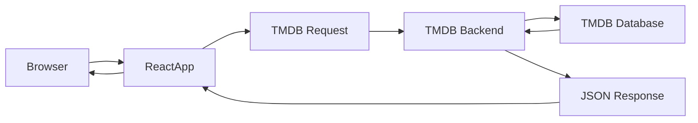

---

# CHAPTER 10 – CSS EXPLANATION

## 10.1 CSS Folder Structure

Each component and page has its own CSS file for scoped styling:
- `src/index.css`
- `src/components/Navbar/Navbar.css`
- `src/components/Footer/Footer.css`
- `src/components/TittleCards/TitleCard.css`
- `src/pages/Home/Home.css`
- `src/pages/Movies/Movies.css`
- `src/pages/Player/Player.css`
- `src/pages/Login/Login.css`

## 10.2 Styling Approach

The application uses imported CSS files rather than CSS-in-JS. Each React component imports the CSS file it needs.

## 10.3 Flexbox

Flexbox is used for:
- Navbar layout.
- Footer icon row.
- Button groups on the home hero.
- Player info layout.

Example:
```css
.footer-icons {
  display: flex;
  gap: 20px;
}
```

## 10.4 Grid

CSS Grid is used for:
- Footer link layout.
- Movies page card grid.

Example:
```css
.movies-grid {
  display: grid;
  grid-template-columns: repeat(auto-fill, minmax(170px, 1fr));
}
```

## 10.5 Responsive Design

Responsive behaviors include:
- hiding desktop navbar links on narrow screens.
- adjusting hero layout and text sizes.
- responsive card sizes in `TitleCard` and `Movies`.
- full-width iframes on mobile.

## 10.6 Media Queries

Media queries are used in every major CSS file to adapt the UI below breakpoints like 900px, 768px, 600px, and 480px.

## 10.7 Animations

Animations and transitions are used for:
- navbar dropdown fade.
- hero pulse effect.
- button hover transitions.
- skeleton shimmer effect.
- login card entrance.
- player fade-in.

## 10.8 Hover Effects

Hover effects appear on:
- nav logo.
- nav links.
- search icons.
- card elements.
- buttons and overlays.

## 10.9 Positioning

Positioning techniques include:
- `position: fixed` for the navbar.
- `position: sticky` for category tabs.
- `position: absolute` for hero caption overlays.
- `position: relative` for card overlays.

## 10.10 Spacing

The UI uses consistent spacing with `margin`, `padding`, and `gap` values. `box-sizing: border-box` is set globally.

## 10.11 Colors

The application uses a dark color palette:
- backgrounds: black and dark gray.
- accents: Netflix red `#e50914`.
- text: white, off-white, and muted gray.
- overlay gradients for depth.

## 10.12 Typography

The global font is `Poppins`. Headings, buttons, and labels use clear font weights and sizes suitable for the theme.

## 10.13 CSS and React Connection

Each React file imports its own CSS file. Class names are used as `className` values in JSX and styled in the corresponding CSS module.

---

# CHAPTER 11 – COMPLETE EXECUTION FLOW

## 11.1 Application Start

The browser loads `index.html`, which contains the `<div id="root"></div>` mount point and script for `src/main.jsx`.

## 11.2 Import Order

- `main.jsx` imports `index.css`, `App.jsx`, and `BrowserRouter`.
- `App.jsx` imports page components.
- Pages import child components and CSS files.

## 11.3 Rendering Order

- React mounts the root component.
- `BrowserRouter` establishes routing context.
- `App` renders `Routes`.
- A matching `Route` renders the selected page component.
- Page components render children and CSS is applied.

## 11.4 State Update Flow

State updates occur when API responses or user actions trigger `setState` calls. React schedules a re-render of the affected component.

## 11.5 Component Update Flow

When a component re-renders, React recomputes JSX and performs reconciliation. Child components re-render if their props changed or parent re-renders.

## 11.6 API Execution Order

Example in `Movies.jsx`:
- `activeCategory` changes.
- effect resets `movies` and loads page data.
- `Promise.all(fetches)` waits for three fetches.
- results update `movies` and `totalPages` state.

## 11.7 DOM Update Process

React generates a new virtual DOM tree. It diffs it against the previous tree and applies only the necessary DOM updates.

---

# CHAPTER 12 – DIAGRAMS

## 12.1 Architecture Diagram

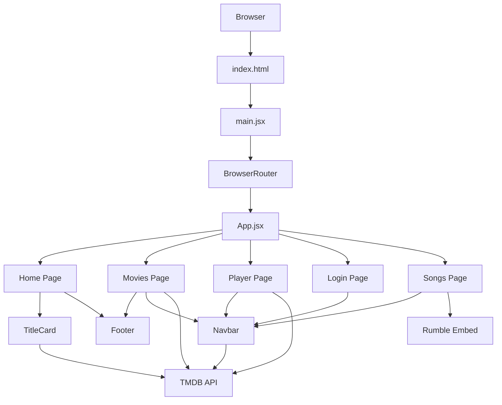

## 12.2 Flowchart

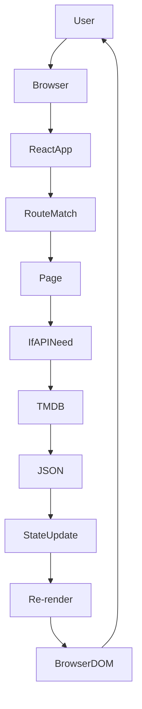

## 12.3 Sequence Diagram

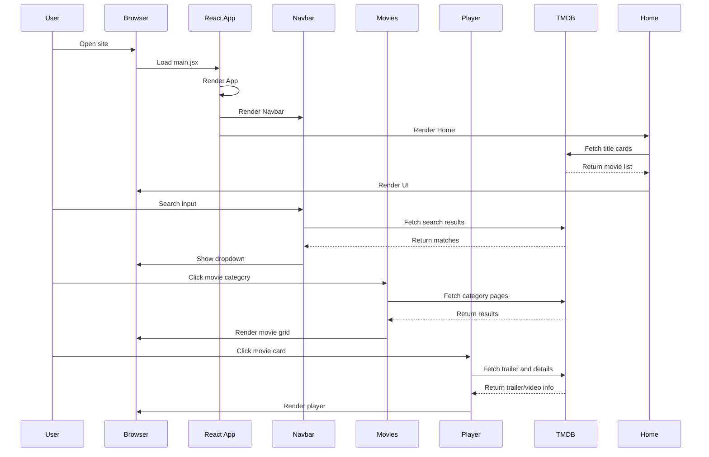

## 12.4 Component Diagram

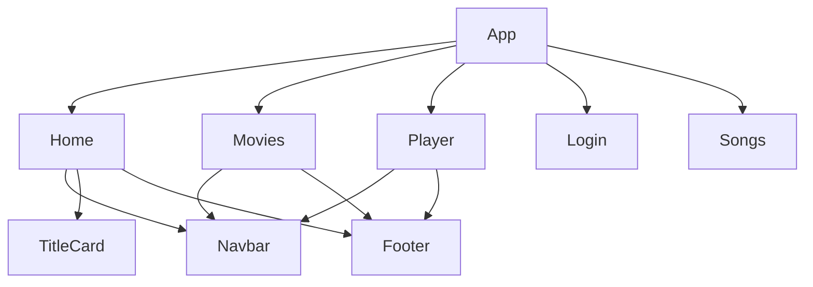

## 12.5 Use Case Diagram

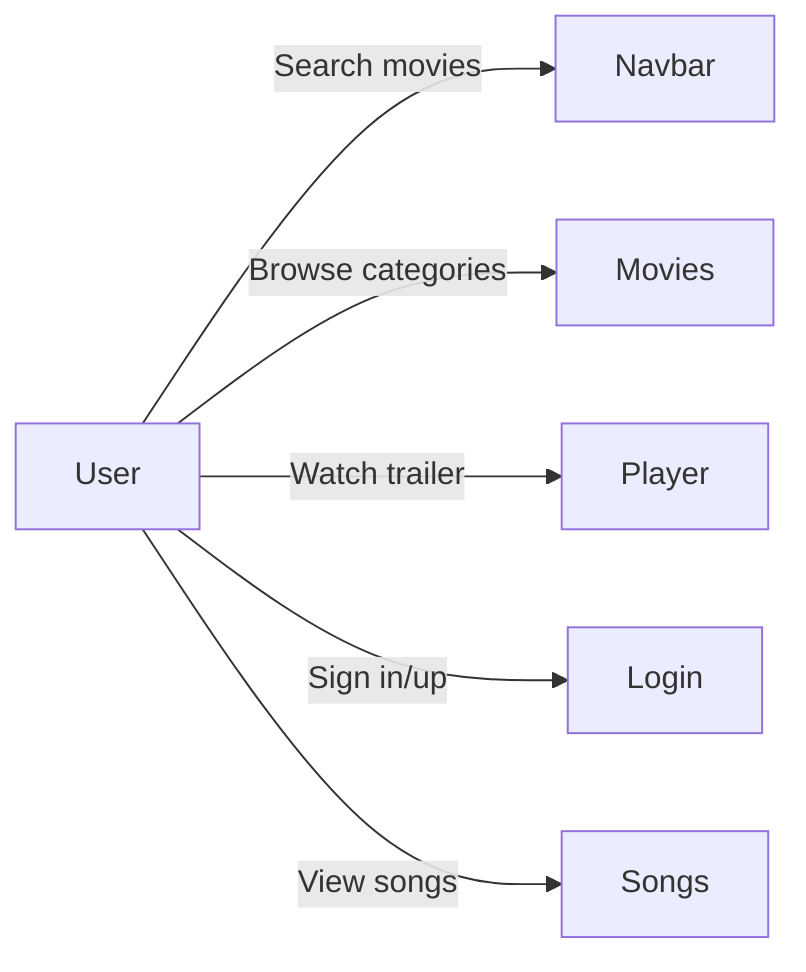

## 12.6 Activity Diagram

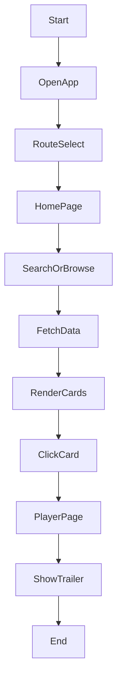

## 12.7 State Diagram

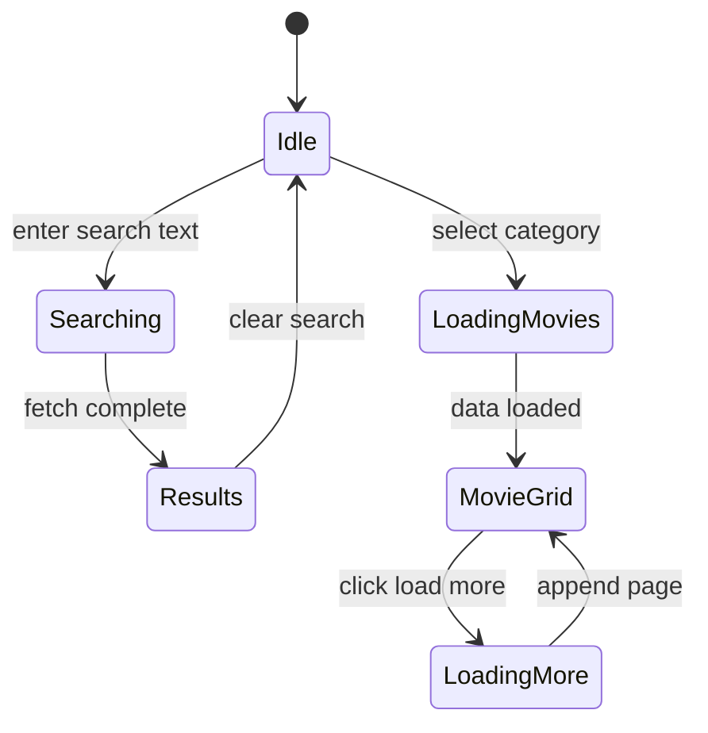

## 12.8 Deployment Diagram

Because this is a frontend-only app, deployment is:
- Source code built by Vite.
- Static assets served by platforms like Vercel or Netlify.
- Browser communicates with TMDB and Rumble.

## 12.9 ER Diagram

No local database exists, so an ER diagram is not applicable.

## 12.10 Data Flow Diagram

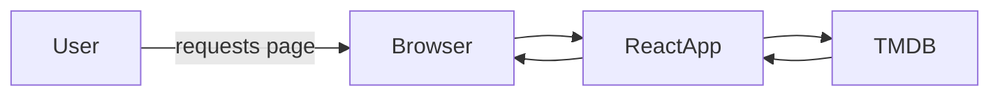

## 12.11 Folder Structure Diagram

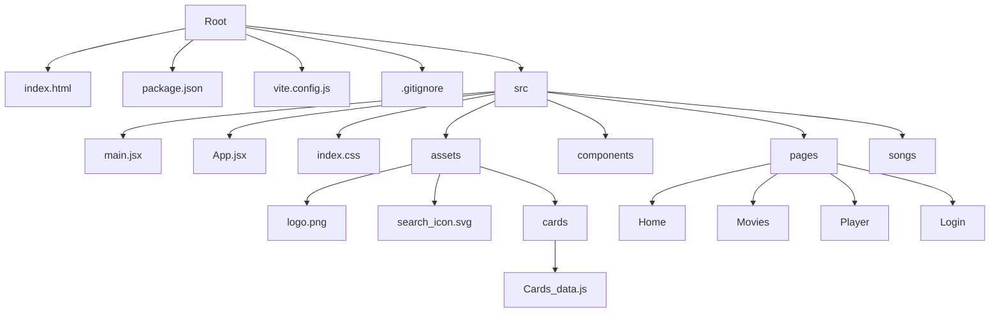

## 12.12 React Rendering Diagram

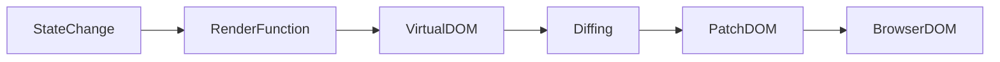

## 12.13 Virtual DOM Diagram

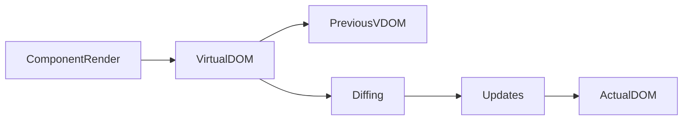

## 12.14 API Communication Diagram

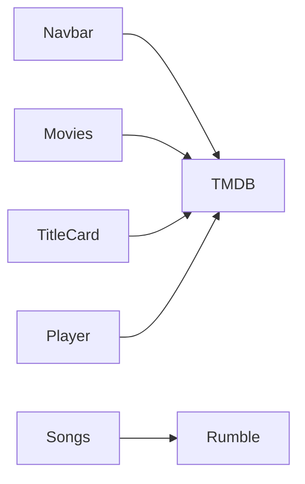

---

# CHAPTER 13 – REACT INTERNAL WORKING

## 13.1 JSX to JavaScript

JSX is transformed into `React.createElement` calls by the build tooling. For example:
```jsx
<div className="hero"></div>
```
becomes:
```js
React.createElement('div', { className: 'hero' })
```

## 13.2 Babel and Vite

Vite uses `@vitejs/plugin-react` to transform JSX and modern JavaScript syntax into browser-compatible code. This plugin may use Oxc or SWC internally.

## 13.3 ReactDOM

The `createRoot` API initializes React's root container. `render()` mounts the React component tree to the DOM node.

## 13.4 Virtual DOM

React creates an in-memory representation of the UI tree. It uses this virtual DOM to minimize the amount of real DOM manipulation.

## 13.5 Reconciliation

When state or props change, React compares the new virtual DOM with the previous one and figures out the smallest set of updates needed.

## 13.6 Diffing Algorithm

React's diffing process compares nodes by type and keys, reusing existing DOM elements when possible.

## 13.7 Internal State Storage

React stores hook state in a linked list of hook objects associated with each component fiber.

## 13.8 Internal Hooks Storage

Hooks are stored in order. Each `useState`, `useEffect`, or `useCallback` call is assigned a slot based on call order.

## 13.9 Re-render Decision

React re-renders a component when its state or props change. It also re-renders when a parent component renders and the child is part of the render tree.

## 13.10 useEffect Execution

Effects run after the render commits to the DOM. The dependency array controls when the effect re-executes.

## 13.11 useState Internals

`useState` returns a state value and setter. Internally, React updates the associated hook entry and schedules a render.

## 13.12 React Router Internals

`BrowserRouter` listens to browser history events. `Routes` collects route definitions and renders the first match. Hooks like `useNavigate`, `useLocation`, and `useParams` read from router context.

---

# CHAPTER 14 – PERFORMANCE

## 14.1 Performance Optimization Used

- Debounced search requests in `Navbar.jsx`.
- `useCallback` for stable fetch function references in `Movies.jsx`.
- Lazy loading of images in the movie grid.
- Skeleton loaders to improve perceived performance during data fetches.

## 14.2 Possible Improvements

- Add route-level lazy loading with `React.lazy`.
- Memoize heavy components with `React.memo`.
- Cache API responses locally.
- Cancel stale fetch requests with `AbortController`.
- Use environment variables for API keys.
- Remove unused imports and assets.

## 14.3 Code Quality

Strengths:
- Clear page and component structure.
- Reusable shared UI components.
- CSS organized per component.

Weaknesses:
- Unused `routing` dependency.
- Imported but unused `cards_data`.
- Placeholder Authorization headers.
- Mixed async patterns (`async/await` and `.then()`).
- Lack of global error handling.

## 14.4 Best Practices

- Consolidate repeated fetch headers and endpoints into utilities.
- Standardize async logic style.
- Use stable keys for list rendering.
- Add proper loading and error states for all API calls.

## 14.5 Memory Optimization

- Remove unused assets.
- Keep DOM trees lightweight.
- Clean up event listeners properly.

## 14.6 Rendering Optimization

- Use memoization for static components.
- Avoid unnecessary state updates.
- Use `useMemo` to compute derived values when needed.

---

# CHAPTER 15 – INTERVIEW QUESTIONS

## 15.1 Beginner Questions

1. What does `createRoot(document.getElementById('root')).render(...)` do in `main.jsx`?
2. Why is `BrowserRouter` used in `main.jsx`?
3. What is the purpose of `Routes` and `Route` in `App.jsx`?
4. Why does `App.jsx` render `Movies` for `/movies`, `/tvshows`, and `/newpopular`?
5. What is the `useState` hook used for in `Navbar.jsx`?
6. What does `useEffect(() => { ... }, [])` mean?
7. What is the purpose of `searchRef` in `Navbar.jsx`?
8. What is the `Link` component used for?
9. How does `Movies.jsx` know which category to load?
10. What does `loading="lazy"` do in `Movies.jsx`?
11. Why does `Player.jsx` use `useParams()`?
12. What is the `fetchPage` function in `Movies.jsx`?
13. What happens when the user types into the Navbar search box?
14. Why is there a fallback `if (!searchQuery.trim())` in Navbar search?
15. What is the `TitleCard` component used for?
16. Why does `TitleCard.jsx` use `useRef` for `cardsRef`?
17. What is the significance of the `category` prop in `TitleCard`?
18. Why is `cards_data` imported into `TitleCard.jsx` even though it is unused?
19. What does `Footer.jsx` render?
20. What is the visual theme of this project?

## 15.2 Intermediate Questions

21. Explain the `Promise.all(fetches)` pattern in `Movies.jsx`.
22. How does `Movies.jsx` avoid duplicate movie cards?
23. What role does `useCallback` play in `Movies.jsx`?
24. Why is `activeCategory` stored in state and also in `searchParams`?
25. How does `Player.jsx` choose between movie and TV trailers?
26. Why are `movieVideo` and `tvVideo` filtered through `pickBestVideo`?
27. What is the purpose of `hoveredId` in `Movies.jsx`?
28. Describe how `Navbar.jsx` closes search when clicking outside.
29. What does `searchOpen` control in the Navbar?
30. Why would `StrictMode` in `main.jsx` be helpful?
31. What issue exists in `TitleCard.jsx` with the wheel handler?
32. What is the likely purpose of `/newpopular` route pointing to `Movies`?
33. How is `isActive` used in `Navbar.jsx`?
34. Why does `netflix_spinner.gif` exist even though it is not used in code?
35. Why is `title?title:"Popular on Netflix"` used in `TitleCard.jsx`?
36. If `searchResults.length === 0`, what does Navbar show?
37. How does `Movies.jsx` build URLs for Telugu movies?
38. What is the advantage of `loadingMore` in `Movies.jsx`?
39. What logic in `Player.jsx` handles missing overview text?
40. Why is `title={videoData.name || 'Trailer'}` used in the iframe?
41. What is a controlled component in `Login.jsx`?
42. How does `Login.jsx` simulate asynchronous authentication?
43. Why is `searchQuery.trim()` used in the search effect?
44. What is the effect of `setSearchOpen(prev => { ... })` in Navbar?
45. How are profile dropdown items activated?
46. What is an example of conditional className usage in this project?
47. What is the primary purpose of `useLocation()` in `Navbar.jsx`?
48. Why does `Movies.jsx` use `useSearchParams` instead of plain state?
49. Why might `/newpopular` route still show the same `Movies` page?
50. What does `setTimeout(() => inputRef.current?.focus(), 50)` do?

## 15.3 Advanced Questions

51. How does `Movies.jsx` implement pagination without a pager UI?
52. How could you convert `Movies.jsx` to support server-side rendering later?
53. Why is deduplication necessary in `Movies.jsx` when loading multiple pages?
54. What is the effect of using `useCallback(..., [])` for `fetchPage`?
55. What would happen if `useEffect` in `Movies.jsx` did not reset `setMovies([])` before loading?
56. How does the app choose TMDB endpoints based on category values?
57. Why is `title || name` used for media titles in `Player.jsx`?
58. What potential bug exists when `detailRes.ok` is not checked in some `fetch()` calls?
59. Why is `setLoading(false)` placed inside both success and catch blocks in `Player.jsx`?
60. What is the importance of `scrollY > 60` in Navbar?
61. Why is `search-container.open .search-input { width: 210px; }` useful?
62. What is the reason for using `useRef(null)` for the input field?
63. How does `componentDidMount` behavior appear in functional components?
64. Why does `TitleCard.jsx` use a `switch` over `category`?
65. Why is it important that `searchResults` are filtered for missing poster/backdrop paths?
66. What is a security issue in the current code?
67. How can you make search results more accessible keyboard-wise?
68. Why is the fallback "Trailer Not Available" screen necessary?
69. How does the app handle TV shows and movies differently in `Player.jsx`?
70. What is the user experience when a search is in progress?
71. Why is the `videoData.type` tag displayed in `Player.jsx`?
72. What is the role of `setSearchParams` in `handleCategoryClick`?
73. What React concept does `searchOpen && searchQuery.trim() !== ''` illustrate?
74. How does the app use absolute image paths for public assets?
75. What is the behavior of `Navbar` when the search icon is clicked while search is open?
76. Why does `Movies.jsx` include both movie and TV categories?
77. What improvement could make `Navbar` search support TV shows too?
78. What is `frameBorder` vs `frameborder` in JSX?
79. Why is `loadingMore && Array.from({ length: 6 }).map(...)` useful?
80. How might you modularize the API options object?
81. Why is `cardsRef.current.scrollLeft += event.deltaY` in `handleWheel`?
82. Why should `useEffect` cleanup listeners when returning a function?
83. What does `useSearchParams` do in React Router?
84. Why is `const pageTitle = isTVPage ? 'Browse All TV Shows' : 'Browse All Movies'` used?
85. What is the advantage of using `useCallback` with `fetchPage`?
86. What would happen if `setMovies(prev => [...prev, ...items])` didn't deduplicate?
87. What are the keys to good list rendering in React?
88. Why does `Navbar` store `isSearching` separate from `searchResults`?
89. Why is `document.addEventListener('mousedown', handler)` used instead of click?
90. How can user input performance be improved when typing search text?
91. What is the advantage of `useNavigate()` in `Login.jsx`?
92. What is the impact of the red accent color in the UI?
93. Why does `Navbar` use `useLocation()` for active nav state?
94. What could happen if `handleMovieClick` did not call `navigate`?
95. What is the user interface purpose of `movies-back-btn` in `Movies.jsx`?
96. What is the likely next step after the `searchResults` dropdown is displayed?
97. What is a sign that a component is not optimized?
98. Why is the login page disclaimer included?
99. How does `TitleCard` select the API endpoint for `telugu-latest`?
100. Why does `Movies.jsx` update `setPage(INITIAL_PAGES)` when the category changes?

---

# CHAPTER 16 – IMPROVEMENTS

## 16.1 Security Improvements

- Remove hardcoded TMDB authorization values from client code.
- Use environment variables or a backend proxy for API credentials.
- Do not expose sensitive keys in public repositories.
- Add HTTPS and secure session handling if authentication is introduced.

## 16.2 Performance Improvements

- Implement `React.lazy` and `Suspense` for route-based code splitting.
- Memoize static or rarely changing components with `React.memo`.
- Cache API responses with session storage or a dedicated cache layer.
- Add request cancellation using `AbortController`.
- Standardize async code style across the codebase.

## 16.3 UI Improvements

- Add a dedicated 404 page.
- Add keyboard navigation for the search dropdown.
- Convert footer text items to actual links.
- Add loading placeholders for `Player` and `Home` images.
- Improve mobile menu accessibility.

## 16.4 Backend Improvements

- Add a backend service to securely manage API keys and user authentication.
- Store user profiles, watch history, and preferences.
- Implement server-side caching for TMDB responses.
- Add authentication middleware and route protection.

## 16.5 Scalability

- Introduce a global state manager or Context API for shared state.
- Break large pages into smaller child components.
- Centralize common API logic in utility modules.
- Add pagination controls and data virtualization for very large lists.

## 16.6 Maintainability

- Remove unused dependencies and imports like `routing` and `cards_data`.
- Consolidate repeated API configuration.
- Add unit tests for critical components.
- Use consistent naming and file organization.
- Consider migrating to TypeScript.

## 16.7 Production Readiness

- Add environment-specific build configuration.
- Add CI checks and linting automation.
- Add accessibility audits and testing.
- Add support for deployment to Vercel, Netlify, or another static host.
- Add structured error reporting and user-friendly fallback messaging.

---

# Notes on Best Practice and Issues

- `StrictMode` is imported in `main.jsx` but not used.
- The `routing` dependency in `package.json` is unused.
- `src/assets/cards/Cards_data.js` is imported but never used.
- `TitleCard.jsx` defines a horizontal scroll handler, but it is not attached to any DOM element.
- The TMDB authorization header is a placeholder and insecure.
- `Footer.jsx` uses list items instead of anchor links.
- `Navbar` search uses `.then()` while other files use `async/await`; standardize the style.
- The app lacks user-facing error messages for API failures.

---

# PDF Style Guidance

This document is formatted as a professional software documentation book suitable for export to PDF. Each chapter is numbered and sectioned. Mermaid diagrams are included for architectural and flow visualization. For a final submission, convert this Markdown file to PDF using a markdown-to-PDF tool such as Pandoc, VS Code extension, or an online converter.